# Лабораторная работа №6  
## Цель работы
Изучение базовых возможностей системы управления версиями, опыт работы с Git Api, опыт работы с локальным и удаленным репозиторием.  
## Ход работы
Сделана копия из указанного репозитория(рис. 1).  
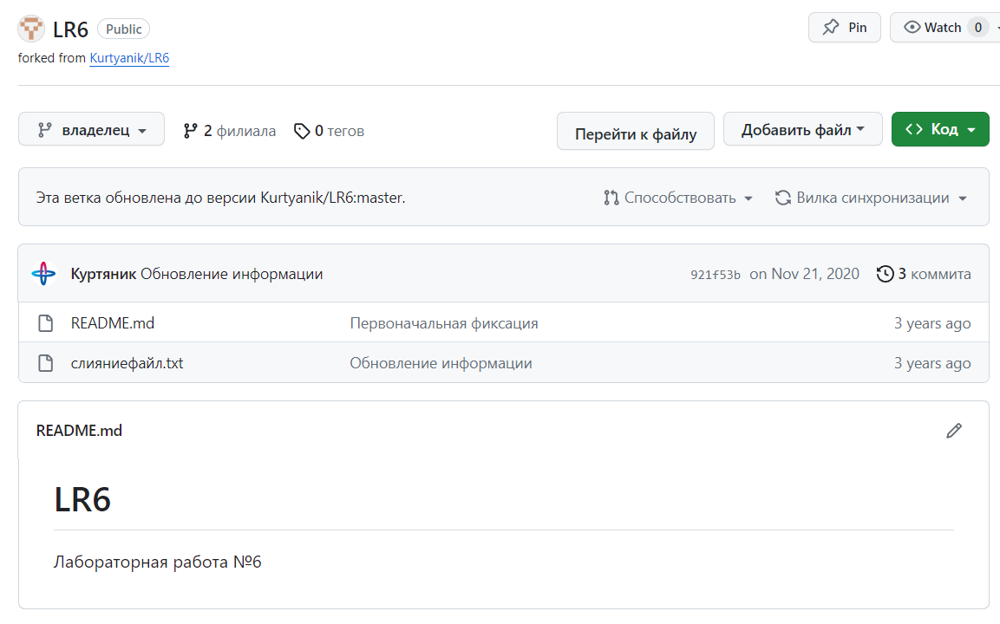

Настроен клиент git(рис.2).  
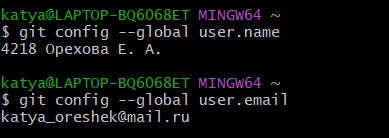

Клонированный личный удаленный репозиторий на компьютер(рис.3).  
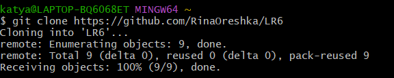

Добавлен файл через интерфейс GitHub(рис.4).  
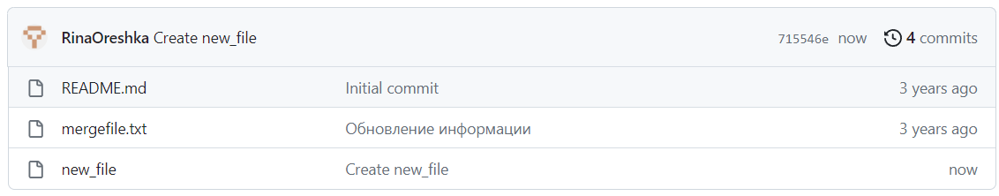

Подтянуты изменения в локальных репозиториях с помощью команды git pull(рис.5).  
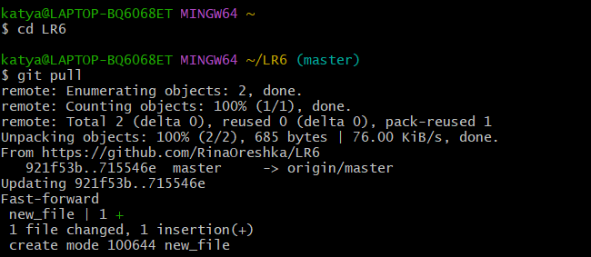

История операций для ветки master (рис.6).  
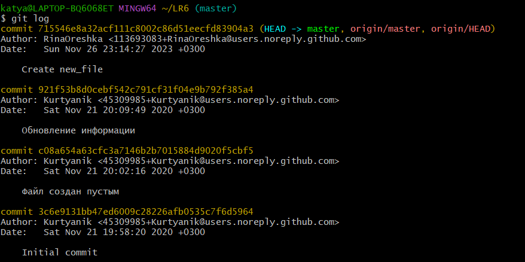

История операций для ветки branch1 (рис.7).  
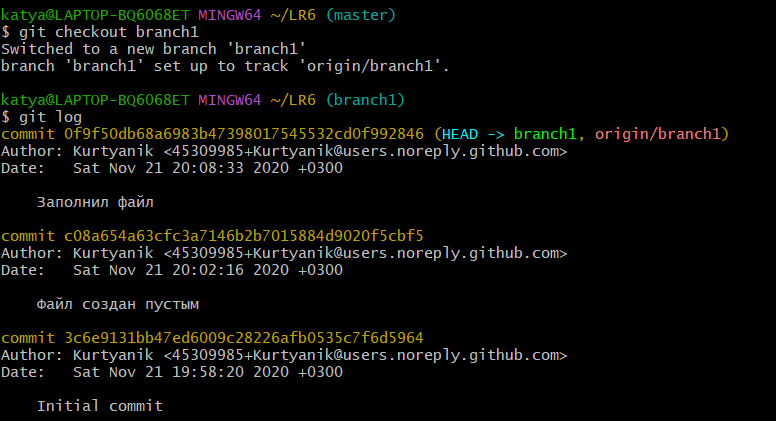

Последние изменения ветки branch1 (рис.8).  

Последние изменения ветки master (рис.9).  
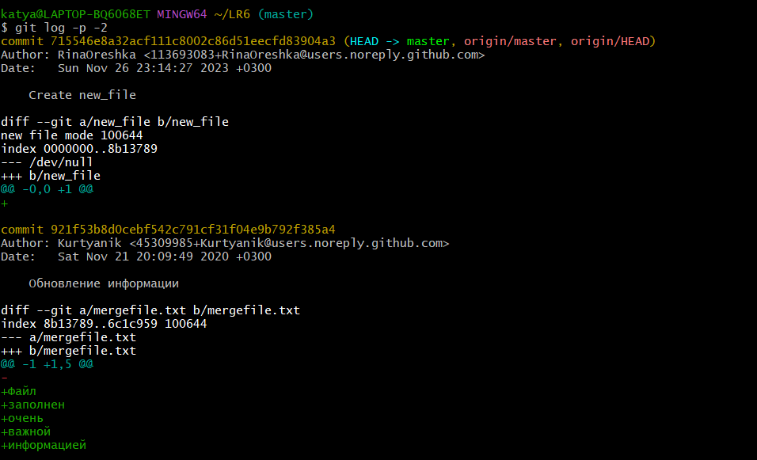

Выполнено слияние в ветку master c помощью команды git merge branch1. Разрешен конфликт. Сделаны и зафиксированы изменения(рис. 10)  
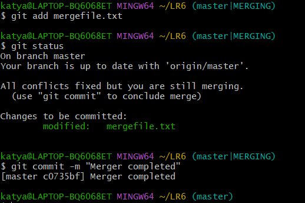.

Удалена побочная ветка branch1 после слияния(рис. 11).  
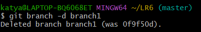

Сделано несколько изменений с комментариями.

Первое изменение(рис. 12).  
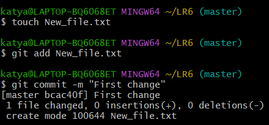

Второе изменение(рис. 13).  
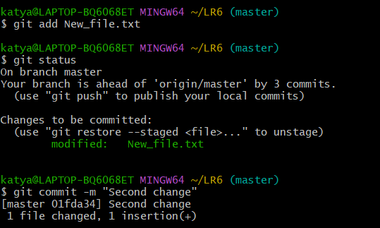

Третье изменение(рис. 14).  
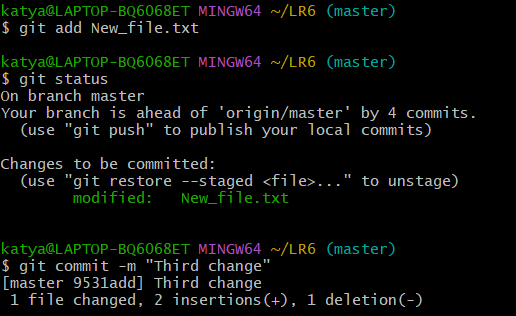

Четвертое изменение(рис. 15).  
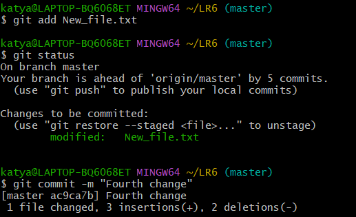

Сделан откат последнего коммита(рис. 16).  
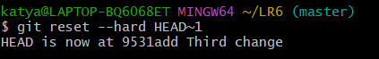

Итоговый список изменений(рис. 17).  
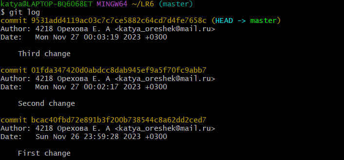

Оформлен отчёт с использованием Visual Studio Code(рис. 18).  
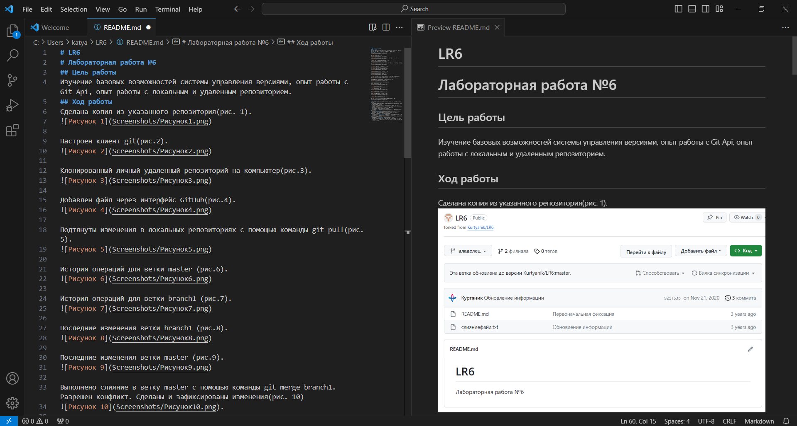

Получена история операций в форматированном виде(рис. 19).  
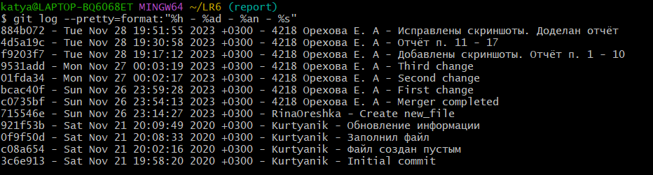

Локальные изменения загружены в сетевое хранилище GitHub.
## Лог команд
* git config --global user.name: установка глобального имени пользователя для Git  
* git config --global user.email: установка глобального адреса электронной почты пользователя для Git  
* git clone : создание локальной копии удаленного репозитория Git  
* git pull: извлечение изменений из удаленного репозитория и объединение их с локальной веткой  
* git log: отображение истории коммитов в репозитории  
* git checkout : переключение между ветками  
* git log -p -2: отображение двух последних коммитов с различиями внутри каждого коммита  
* git merge <name_branch>: объединение указанной ветки с текущей веткой
* git add: добавление изменений файлов в индекс для коммита  
* git status: отобраение текущего состояния репозитория, включая измененные, добавленные и неотслеживаемые файлы  
* git checkout -b <name_branch>: создание новой ветки и переключение на нее
* git commit -m : создание коммита с указанным сообщением  
* git reset --hard HEAD~1: отмена последнего коммита и переключение текущей ветки на предыдущий коммит  
* git branch -d <name_branch>: удаление указанной ветки  
* git log --pretty=format:"%h - %ad - %an - %s": отображение   истории коммитов в форматированном виде, включая хеш коммита, дату, автора и сообщение коммита  

## Вывод

В ходе лабораторной работы были изучены базовые возможности системы управления версиями, получен опыт работы с Git Api и опыт работы с локальным и удаленным репозиторием.